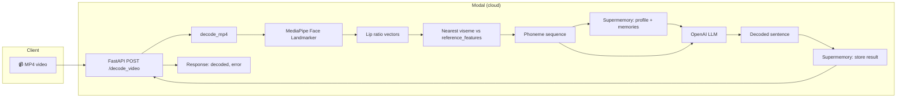

# Vizem Flow

**Voice typing speed. Zero voice.**

Being “voicepilled” was 2024. In 2025 you don’t need to use your voice at all. LipVisemes turns **lip-reading** into text - so you get a super smooth, fast typing flow even in public. No mumbling into your phone, no awkward “I’m talking to my computer” moments. Just you, the camera, and **~10–20× the speed of typing** with the same ease as voice input.

---

## How it works

We built a **personalized viseme model** from reference images with known labels:

1. **Reference images** — Photos of you (or the target speaker) saying specific sounds: e.g. one image saying **F**, one for **M**, **AH**, etc. Each image is already labeled with the viseme/phoneme it represents.
2. **Lip geometry** — We run MediaPipe’s face landmarker on those images and compute **lip dimensions and spacing** (width, height, aspect ratios) for each label. Those vectors are averaged per viseme and saved as a reference set (e.g. `reference_features.json`).
3. **Video → text** — For any new video, we run the same pipeline frame-by-frame on Modal’s infrastructure: MediaPipe extracts lip geometry per frame, we match it to the nearest reference viseme, and output a **phoneme/viseme sequence**. A fast LLM (OpenAI) plus **Supermemory** then decodes that sequence into a single, natural sentence.

So: **your labeled reference images define “what an F (or M, AH, …) looks like” for your face; we apply that template across the whole video via Modal’s fast AI inference.**

---

## Architecture



**In words:** Upload an MP4 → Modal runs the viseme pipeline (MediaPipe + your reference features) → sequence of phoneme-like tokens → OpenAI LLM gets optional context from Supermemory and decodes to one sentence → response returned; the decode is also stored in Supermemory for future context.

---

## Requirements & setup

### 1. Prerequisites

- **Python 3.12+** (e.g. `uv` or `pip`)
- A **Modal** account ([modal.com](https://modal.com))
- **OpenAI** API key ([platform.openai.com](https://platform.openai.com))
- **Supermemory** API key ([console.supermemory.ai](https://console.supermemory.ai))
- **MediaPipe face landmarker model** (see below)

### 2. MediaPipe model

Download the face landmarker task file into the repo root:

- **URL:** [face_landmarker.task](https://storage.googleapis.com/mediapipe-models/face_landmarker/face_landmarker/float16/1/face_landmarker.task)
- **Path:** `lipvisemes/face_landmarker.task`

Without this file, the pipeline will raise a `FileNotFoundError` with the same URL.

### 3. Reference features (personalized visemes)

The decoder uses a **reference set of lip-shape vectors** per viseme, built from pre-labeled images:

- **Reference images:** In `reference_target_labels.py`, `REFERENCE_IMAGES` maps viseme names to paths under `images_with_reference/` (e.g. images of you saying F, M, AH, etc.).
- **Build reference features:** From the `lipvisemes` directory run:
  ```bash
  uv run python extract_reference_features.py
  ```
  This runs MediaPipe on each reference image, computes lip ratio vectors, averages per viseme, and writes **`reference_features.json`**. That file is loaded at runtime for nearest-neighbor viseme classification.

If `reference_features.json` is missing, the code falls back to a simple rule-based classifier (less accurate).

### 4. Local env (optional, for running decode locally)

Create a `.env` in the `lipvisemes` directory (do not commit):

```env
OPENAI_API_KEY=sk-...
SUPERMEMORY_API_KEY=sm_...
```

Use these for local runs (e.g. `uv run python lipvisemes.py path/to/video.mp4`).

### 5. Modal app setup

**Install Modal and log in:**

```bash
pip install modal
# or: uv add modal
modal token new
```

**Create Modal secrets** (so the cloud app can call OpenAI and Supermemory):

```bash
# OpenAI
modal secret create openai-api-key OPENAI_API_KEY=sk_your_openai_key

# Supermemory
modal secret create supermemory-api-key SUPERMEMORY_API_KEY=sm_your_supermemory_key
```

**Deploy the app:**

From the repo root (directory containing `modal_app.py`):

```bash
modal deploy modal_app.py
```

Modal will build the image (OpenCV, MediaPipe, OpenAI, Supermemory, FastAPI), mount the app directory (so `face_landmarker.task`, `reference_features.json`, and `reference_target_labels.py` are available), and expose the HTTP endpoint.

**Get the endpoint URL** from the deploy output or:

```bash
modal app list
# then open the app and copy the endpoint URL for decode_video
```

**Call the API:**

```bash
curl -X POST "https://<your-workspace>--lipvisemes-decode-video.modal.run" \
  -F "file=@path/to/your/video.mp4"
```

Response:

```json
{"decoded": "The sentence the model decoded from your lips.", "error": null}
```

Use a **long timeout** (e.g. 90s) and retry once on failure; decoding a full video can take a minute.

---

## Summary

| What | Description |
|------|-------------|
| **Input** | MP4 video (face visible, speaking). |
| **Output** | One decoded sentence (JSON: `decoded`, `error`). |
| **Personalization** | Reference images + `extract_reference_features.py` → `reference_features.json`. |
| **Cloud** | Modal runs the pipeline; OpenAI for the LLM; Supermemory for context and storage. |
| **Why** | Voice-like speed and flow, without speaking—usable anywhere. |
